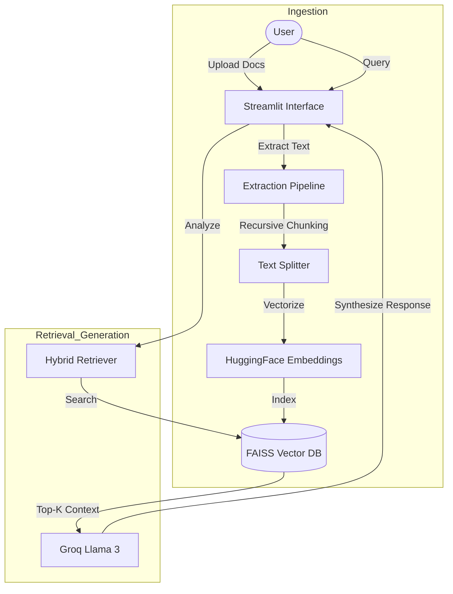
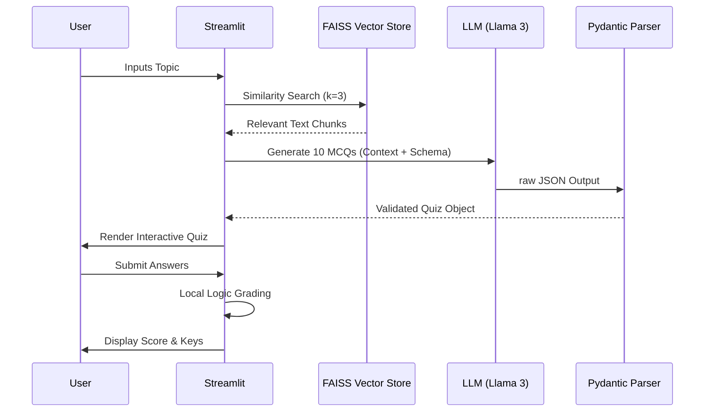

# AI Tutor: System Architecture & Design

This document provides a technical deep dive into the architecture of AI Tutor, detailing the data flow, component interactions, and the RAG pipeline design.

## 📐 High-Level Architecture

AI Tutor follows a **modular, component-based architecture** where the frontend (Streamlit) interacts with an orchestration layer (LangChain) to process data and generate AI-driven insights.

> [!IMPORTANT]
> **Data Privacy**: All document processing and vectorization happen locally in-memory. Only the relevant context chunks and the user query are sent to the Groq API for generation.

## 🧩 Core Architectural Pillars

### 1. The RAG Pipeline (Retrieval-Augmented Generation)
Our RAG implementation focuses on **contextual fidelity**. Instead of relying on a broad knowledge base, the system strictly grounds its answers in the provided documents.
- **In-Memory FAISS**: We utilize an in-memory FAISS index for sub-millisecond similarity searches.
- **MMR (Maximum Marginal Relevance)**: The retriever uses MMR to ensure diversity in the retrieved chunks, preventing the LLM from receiving redundant information.

### 2. State Management via LangGraph
For complex workflows like the **Study Assistant**, we use **LangGraph** to manage the state of the conversation and the query analysis process. This allows for:
- **Query Refinement**: Re-writing the user's question into a more index-friendly search query.
- **Modular Nodes**: Independent nodes for retrieval and generation, making the system easier to debug and scale.

### 3. Data Ingestion & Processing
The extraction pipeline supports multi-format ingestion (PDF, DOCX).
- **Extraction**: Uses `PyPDF2` and `python-docx` for robust text recovery.
- **Chunking Strategy**: Employs `RecursiveCharacterTextSplitter` with an overlap of 200 characters to maintain semantic continuity across chunk boundaries.

## ⛓️ Workflow Detail

### Quiz Generation Workflow
1. **Context Extraction**: Retrieves the most relevant segments based on a chosen topic.
2. **Schema-Driven Generation**: Uses `Pydantic` and `JsonOutputParser` to force the LLM to output valid JSON matching our quiz structure.
3. **Deterministic Evaluation**: The application logic (not the LLM) handles the grading to ensure 100% accuracy in scoring.

### Roadmap Generation Workflow
- **Persona-Based Prompting**: The LLM is initialized with an "Expert Curriculum Designer" persona.
- **Topic-Centric Design**: Focuses on logical skill progression rather than arbitrary time-frames, providing a more professional and realistic learning path.

---

## 🔄 Detailed Process Flow: Quiz Generation

The Quiz Generator utilizes a deterministic logic loop wrapped around LLM-driven content synthesis.

> [!TIP]
> **Deterministic Grading**: By separating the "thinking" (question generation) from the "calculating" (scoring), we eliminate LLM hallucinations during grading.

---

## 🛠️ Design Rationale

- **Why FAISS?** It offers industry-leading speed for similarity search and is lightweight enough to run in-memory without a complex database setup.
- **Why Groq?** Groq's LPUs provide exceptionally low latency for Llama 3 models, making the interactive parts of the app (Chat, Quizzes) feel instantaneous.
- **Why LangChain?** It provides the standardized abstractions needed to swap models or vector stores in the future with minimal code changes.

---
Sai Buvanesh